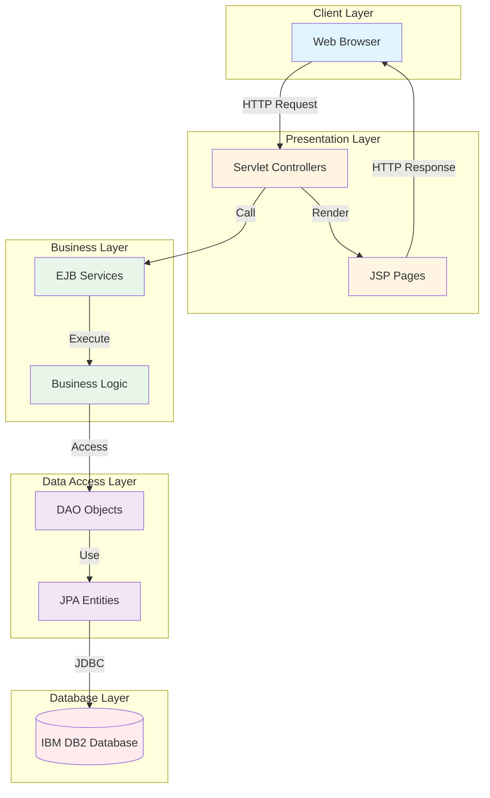

# Wealthcare Application - Project Overview

## Table of Contents
- [Introduction](#introduction)
- [Project Purpose](#project-purpose)
- [Key Features](#key-features)
- [Technology Stack](#technology-stack)
- [Project Structure](#project-structure)
- [User Personas](#user-personas)
- [System Architecture Overview](#system-architecture-overview)
- [Quick Links](#quick-links)

## Introduction

Wealthcare is a comprehensive wealth management application built as a Java EE monolithic application. It provides a complete platform for managing customer financial plans, investments, and portfolios through a role-based access system.

The application follows enterprise Java standards and leverages EJB (Enterprise JavaBeans) for business logic, JPA for data persistence, and JSP/Servlets for the presentation layer.

## Project Purpose

The Wealthcare application serves as a financial planning and wealth management platform that connects three key stakeholders:

- **Business Managers** who oversee the organization and manage the wealth manager workforce
- **Wealth Managers** who create and manage financial plans for their assigned customers
- **Customers** who track their financial goals, investments, and portfolio performance

The system enables end-to-end wealth management from customer onboarding to goal tracking and investment monitoring.

## Key Features

### 🔐 Multi-Role Access System
- Role-based authentication and authorization (BM, WM, CU)
- Session-based security management
- Separate workflows and UI for each role
- Secure login and logout functionality

### 💼 Financial Planning
- Goal creation and tracking with target amounts and dates
- Investment portfolio management across multiple asset types
- Real-time quote integration for investment valuation
- Progress visualization with charts and graphs
- Historical performance tracking

### 👥 Customer Management
- Comprehensive customer profiles with personal information
- Family information tracking (spouse and children details)
- Wealth manager assignment and relationship management
- Portfolio overview and summary reports
- Customer lifecycle management

### 📊 Investment Tracking
- Multiple investment types:
  - Stocks
  - Mutual Funds
  - Fixed Deposits
- Historical investment data with date tracking
- Current value calculations with quote integration
- Performance analytics and reporting
- Investment allocation visualization

### 📈 Reporting & Analytics
- Goal progress tracking
- Portfolio performance metrics
- Investment distribution charts (Bar and Line graphs)
- Target vs. actual comparisons
- Time-based performance analysis

## Technology Stack

### Backend Technologies
```
┌─────────────────────────────────────┐
│     Presentation Layer              │
│  - JSP (JavaServer Pages)           │
│  - Servlets                         │
│  - HTML/CSS/JavaScript              │
└─────────────────────────────────────┘
           ↓
┌─────────────────────────────────────┐
│     Business Logic Layer            │
│  - EJB 3.x (Stateless Session Beans)│
│  - Business Services                │
│  - Transaction Management           │
└─────────────────────────────────────┘
           ↓
┌─────────────────────────────────────┐
│     Data Access Layer               │
│  - JPA 2.1 (Java Persistence API)   │
│  - DAO Pattern                      │
│  - Entity Beans                     │
└─────────────────────────────────────┘
           ↓
┌─────────────────────────────────────┐
│     Database Layer                  │
│  - IBM DB2                          │
│  - JDBC Connectivity                │
└─────────────────────────────────────┘
```

### Core Technologies
- **Java EE 7**: Enterprise application framework
- **EJB 3.x**: Enterprise JavaBeans for business logic
- **JPA 2.1**: Java Persistence API for ORM
- **Servlets 3.1**: Web request handling
- **JSP 2.3**: JavaServer Pages for dynamic UI

### Application Server
- **IBM WebSphere Application Server**: Primary deployment target
- Compatible with Java EE 7 compliant application servers

### Database
- **IBM DB2**: Primary relational database
- JDBC connectivity via DB2 JCC driver (version 10.1)
- Support for other databases through JPA abstraction layer

### Libraries & Dependencies
- **Jackson Annotations**: JSON processing and serialization
- **DB2 JDBC Driver** (db2jcc4-10.1.jar): Database connectivity

## Project Structure

```
wealthcare-app/
│
├── wcareEJB/                           # EJB Module (Business Logic Layer)
│   ├── ejbModule/
│   │   └── com/gan/wcare/
│   │       ├── common/                 # Utility Classes
│   │       │   ├── BooleanUtil.java
│   │       │   ├── CommonConstants.java
│   │       │   ├── DateUtil.java
│   │       │   ├── LoginUtil.java
│   │       │   ├── LogUtil.java
│   │       │   ├── MyUtil.java
│   │       │   ├── NumberUtil.java
│   │       │   └── StringUtil.java
│   │       │
│   │       ├── ejb/
│   │       │   ├── model/              # Data Transfer Objects
│   │       │   │   ├── CustomError.java
│   │       │   │   ├── GoalInfo.java
│   │       │   │   ├── GoalTotalData.java
│   │       │   │   ├── GraphDataBar.java
│   │       │   │   ├── GraphDataLine.java
│   │       │   │   ├── InvestmentInfo.java
│   │       │   │   ├── LoginInfo.java
│   │       │   │   └── QuoteCacheInfo.java
│   │       │   │
│   │       │   └── user/               # EJB Services (Business Logic)
│   │       │       ├── FinanceQuoteEJB.java
│   │       │       ├── FinancialPlannerEJB.java
│   │       │       ├── ImageServiceEJB.java
│   │       │       ├── LoginServiceEJB.java
│   │       │       ├── WcBusinessManagerEJB.java
│   │       │       ├── WcCustomerEJB.java
│   │       │       ├── WcGoalEJB.java
│   │       │       ├── WcInvestmentEJB.java
│   │       │       ├── WcUsersEJB.java
│   │       │       └── WcWealthManagerEJB.java
│   │       │
│   │       └── jpa/
│   │           ├── dao/                # Data Access Objects
│   │           │   ├── DaoBase.java
│   │           │   ├── WcBusinessManagerDao.java
│   │           │   ├── WcCustomerDao.java
│   │           │   ├── WcGoalDao.java
│   │           │   ├── WcInvestmentDao.java
│   │           │   ├── WcUsersDao.java
│   │           │   └── WcWealthManagerDao.java
│   │           │
│   │           └── entity/             # JPA Entity Beans
│   │               ├── WcBusinessManager.java
│   │               ├── WcCustomer.java
│   │               ├── WcGoal.java
│   │               ├── WcInvestment.java
│   │               ├── WcUsers.java
│   │               └── WcWealthManager.java
│   │
│   ├── META-INF/
│   │   └── persistence.xml             # JPA Configuration
│   │
│   └── lib/                            # EJB Module Dependencies
│       ├── com.fasterxml.jackson.annotations.jar
│       └── db2jcc4-10.1.jar
│
├── wcareWeb/                           # Web Module (Presentation Layer)
│   ├── src/
│   │   └── com/gan/wcare/servlet/      # Servlet Controllers
│   │       ├── LoginServlet.java
│   │       │
│   │       ├── businessmanager/        # Business Manager Servlets
│   │       │   ├── BmCustomerListServlet.java
│   │       │   └── BmWealthManagerListServlet.java
│   │       │
│   │       ├── customer/               # Customer Servlets
│   │       │   ├── CusFinancialPlanDetailServlet.java
│   │       │   ├── CusFinancialPlanListServlet.java
│   │       │   ├── CusPortfolioListServlet.java
│   │       │   └── CusProfileListServlet.java
│   │       │
│   │       └── wealthmanager/          # Wealth Manager Servlets
│   │           ├── WmCustomerListServlet.java
│   │           ├── WmFinancialPlanAddServlet.java
│   │           ├── WmFinancialPlanDetailServlet.java
│   │           ├── WmFinancialPlanListServlet.java
│   │           ├── WmInvestmentAddServlet.java
│   │           ├── WmPortfolioListServlet.java
│   │           └── WmProfileListServlet.java
│   │
│   ├── WebContent/                     # Web Resources
│   │   ├── index.jsp                   # Login Page
│   │   │
│   │   ├── common/                     # Shared Components
│   │   │   ├── common_header.jsp
│   │   │   └── common_footer.jsp
│   │   │
│   │   ├── bm/                         # Business Manager JSPs
│   │   │   ├── bm_cus_list.jsp
│   │   │   └── bm_wm_list.jsp
│   │   │
│   │   ├── cus/                        # Customer JSPs
│   │   │   ├── cus_fp_detail.jsp
│   │   │   ├── cus_fp_list.jsp
│   │   │   ├── cus_portfolio_list.jsp
│   │   │   └── cus_profile_list.jsp
│   │   │
│   │   └── wm/                         # Wealth Manager JSPs
│   │       ├── wm_cus_list.jsp
│   │       ├── wm_fp_add.jsp
│   │       ├── wm_fp_detail.jsp
│   │       ├── wm_fp_list.jsp
│   │       ├── wm_investement_add.jsp
│   │       ├── wm_portfolio_list.jsp
│   │       └── wm_profile_list.jsp
│   │
│   └── WEB-INF/                        # Web Configuration
│
├── sql/                                # Database Scripts
│   ├── schema-db2.sql                  # DB2 Schema Definition
│   └── data.sql                        # Sample Data
│
├── lib/                                # Shared Libraries
│   ├── com.fasterxml.jackson.annotations.jar
│   └── db2jcc4-10.1.jar
│
├── .gitignore
├── LICENSE                             # Apache-2.0 License
└── README.md                           # Project README
```

## User Personas

### 1. Business Manager (BM) 👔

**Role**: Administrative oversight and organizational management

**Primary Responsibilities**:
- Create and manage Wealth Manager accounts
- Create and manage Customer accounts
- Assign Wealth Managers to Customers
- View organizational data and reports
- Oversee system operations

**Access Level**: Highest administrative privileges

**Key Workflows**:
- Wealth Manager onboarding
- Customer onboarding
- Assignment management
- Organizational reporting

**Typical Use Cases**:
- "Create a new wealth manager account for a new hire"
- "Assign customers to wealth managers based on expertise"
- "View all customers and their assigned wealth managers"

---

### 2. Wealth Manager (WM) 💼

**Role**: Financial planning and investment management for assigned customers

**Primary Responsibilities**:
- View and manage assigned customers
- Create financial goals for customers
- Add and track investments for each goal
- Monitor customer portfolios
- Generate financial reports
- Provide investment recommendations

**Access Level**: Customer data management within assigned portfolio

**Key Workflows**:
- Customer portfolio review
- Goal creation and management
- Investment addition and tracking
- Performance monitoring
- Report generation

**Typical Use Cases**:
- "Create a retirement savings goal for a customer"
- "Add a mutual fund investment to a customer's education goal"
- "Review portfolio performance for quarterly meeting"
- "Track progress toward customer's house purchase goal"

---

### 3. Customer (CU) 👤

**Role**: End-user viewing and tracking personal financial information

**Primary Responsibilities**:
- View personal financial plans and goals
- Track investment portfolios
- Monitor goal progress
- View profile information
- Access financial reports

**Access Level**: Read-only access to personal data only

**Key Workflows**:
- Financial plan review
- Portfolio monitoring
- Goal progress tracking
- Profile viewing

**Typical Use Cases**:
- "Check progress on my retirement savings goal"
- "View my current investment portfolio value"
- "See all my financial goals and their status"
- "Review my personal profile information"

## System Architecture Overview



## Quick Links

- [📐 Architecture Documentation](./02-ARCHITECTURE.md) - Detailed system architecture and design patterns
- [🗄️ Database Schema](./03-DATABASE-SCHEMA.md) - Complete database structure and relationships
- [🔌 API Reference](./04-API-REFERENCE.md) - EJB service documentation and usage
- [🔄 User Workflows](./05-USER-WORKFLOWS.md) - Role-based workflows and processes
- [🚀 Deployment Guide](./06-DEPLOYMENT-GUIDE.md) - Installation and deployment instructions
- [👨‍💻 Developer Guide](./07-DEVELOPER-GUIDE.md) - Development environment setup and guidelines

## System Requirements

### Development Environment
- **JDK**: Java Development Kit 8 or higher
- **Application Server**: IBM WebSphere Application Server 8.5+ or compatible Java EE 7 server
- **Database**: IBM DB2 10.1 or higher
- **IDE**: Eclipse IDE for Java EE Developers or IntelliJ IDEA Ultimate
- **Build Tool**: Maven or Gradle (optional)
- **Version Control**: Git

### Runtime Environment
- **JRE**: Java Runtime Environment 8 or higher
- **Application Server**: IBM WebSphere Application Server
- **Database**: DB2 Database with configured schema
- **Memory**: Minimum 2GB RAM (4GB recommended)
- **Storage**: 500MB for application, additional space for database
- **Network**: HTTP/HTTPS access for web interface

### Browser Compatibility
- Chrome 90+
- Firefox 88+
- Safari 14+
- Edge 90+

## License

The Wealthcare monolith Application is licensed under **Apache-2.0 License**.

See the [LICENSE](../LICENSE) file for full license text.

## Getting Started

### Quick Start Guide

1. **Understand the System**
   - Review this overview document
   - Read the [Architecture Documentation](./02-ARCHITECTURE.md)

2. **Set Up Development Environment**
   - Follow the [Developer Guide](./07-DEVELOPER-GUIDE.md)
   - Configure your IDE and tools

3. **Configure Database**
   - Review [Database Schema](./03-DATABASE-SCHEMA.md)
   - Run schema and data scripts

4. **Deploy Application**
   - Follow the [Deployment Guide](./06-DEPLOYMENT-GUIDE.md)
   - Configure WebSphere and deploy EAR

5. **Explore Features**
   - Review [User Workflows](./05-USER-WORKFLOWS.md)
   - Test with sample users from data.sql

### Sample Login Credentials

From the sample data (sql/data.sql):

**Business Manager**:
- Username: `harry` / Password: `harry`
- Username: `charlie` / Password: `charlie`

**Wealth Manager**:
- Username: `jerald` / Password: `jerald`
- Username: `charlotte` / Password: `charlotte`

**Customer**:
- Username: `william` / Password: `william`
- Username: `sandy` / Password: `sandy`

## Support and Contribution

For questions, issues, or contributions, please refer to the project repository.

---

**Document Version**: 1.0  
**Last Updated**: 2026-01-29  
**Maintained By**: Wealthcare Development Team