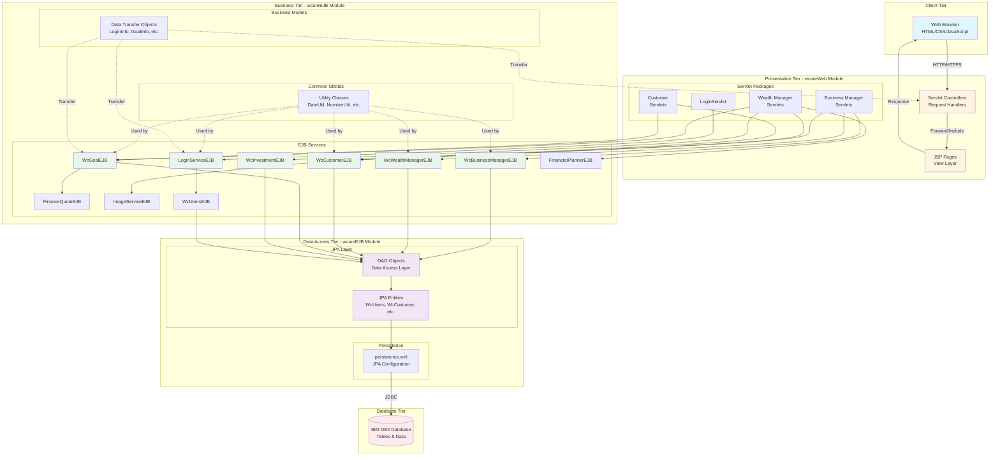
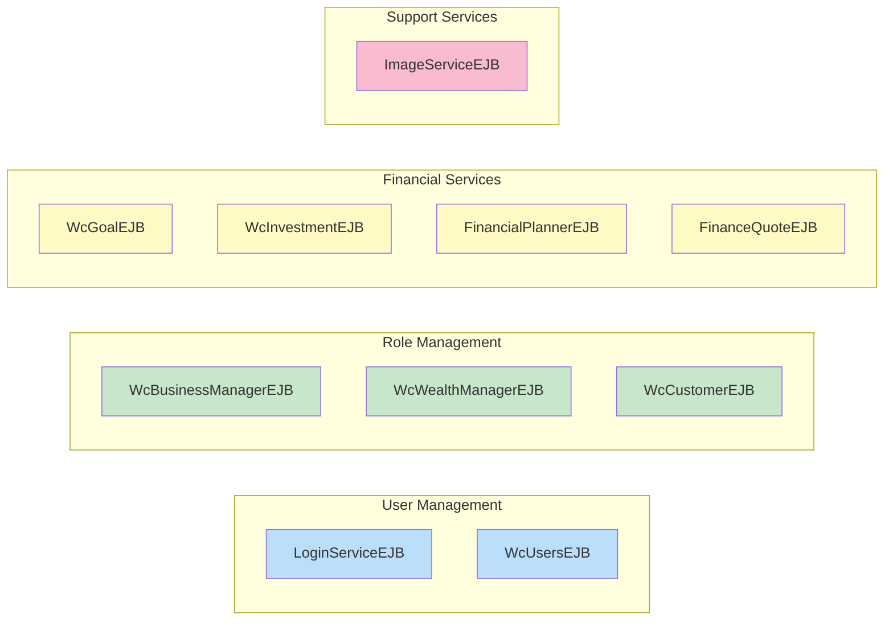
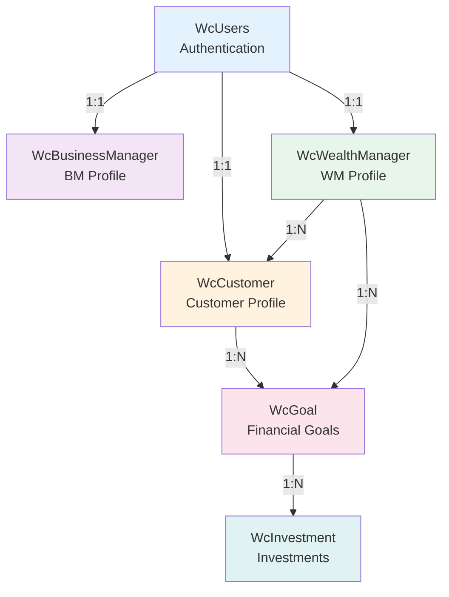
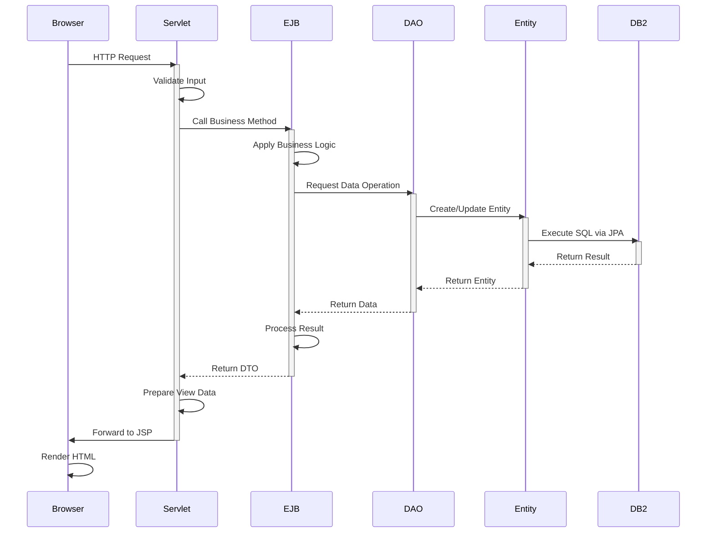
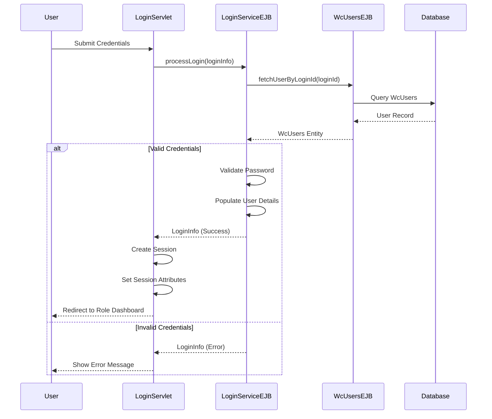
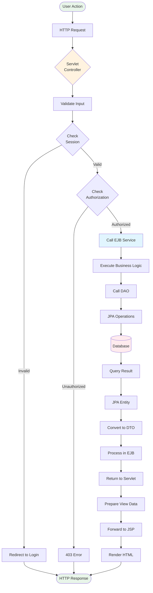

# Wealthcare Application - Architecture Documentation

## Table of Contents
- [Architecture Overview](#architecture-overview)
- [System Architecture](#system-architecture)
- [Layer Architecture](#layer-architecture)
- [Component Architecture](#component-architecture)
- [Design Patterns](#design-patterns)
- [Security Architecture](#security-architecture)
- [Data Flow](#data-flow)
- [Module Dependencies](#module-dependencies)

## Architecture Overview

The Wealthcare application follows a **three-tier monolithic architecture** pattern, implementing a clear separation of concerns across presentation, business logic, and data access layers. The application is built using Java EE standards and leverages Enterprise JavaBeans (EJB) for business logic encapsulation.

### Architectural Principles

1. **Separation of Concerns**: Clear boundaries between presentation, business, and data layers
2. **Modularity**: Organized into distinct EJB and Web modules
3. **Reusability**: Common utilities and services shared across components
4. **Maintainability**: Consistent patterns and naming conventions
5. **Scalability**: Stateless EJBs for horizontal scaling capability

## System Architecture

### High-Level Architecture Diagram



## Layer Architecture

### 1. Presentation Layer (wcareWeb Module)

**Purpose**: Handle user interactions and render views

**Components**:
- **JSP Pages**: Dynamic HTML generation with embedded Java
- **Servlet Controllers**: Request routing and response handling
- **Session Management**: User authentication state

**Key Responsibilities**:
- Receive HTTP requests from clients
- Validate user input
- Call appropriate EJB services
- Prepare data for view rendering
- Manage user sessions
- Handle navigation flow

**Technology Stack**:
- JSP 2.3
- Servlets 3.1
- HTML5/CSS3
- JavaScript

**Package Structure**:
```
com.gan.wcare.servlet
├── LoginServlet.java
├── businessmanager/
│   ├── BmCustomerListServlet.java
│   └── BmWealthManagerListServlet.java
├── customer/
│   ├── CusFinancialPlanDetailServlet.java
│   ├── CusFinancialPlanListServlet.java
│   ├── CusPortfolioListServlet.java
│   └── CusProfileListServlet.java
└── wealthmanager/
    ├── WmCustomerListServlet.java
    ├── WmFinancialPlanAddServlet.java
    ├── WmFinancialPlanDetailServlet.java
    ├── WmFinancialPlanListServlet.java
    ├── WmInvestmentAddServlet.java
    ├── WmPortfolioListServlet.java
    └── WmProfileListServlet.java
```

---

### 2. Business Logic Layer (wcareEJB Module)

**Purpose**: Implement business rules and orchestrate operations

**Components**:
- **EJB Services**: Stateless session beans
- **Business Models**: DTOs for data transfer
- **Utility Classes**: Common helper functions

**Key Responsibilities**:
- Implement business logic and rules
- Coordinate between presentation and data layers
- Manage transactions
- Perform calculations and validations
- Handle business exceptions
- Provide service interfaces

**Technology Stack**:
- EJB 3.x (Stateless Session Beans)
- CDI (Contexts and Dependency Injection)
- Java 8

**EJB Services**:



**Package Structure**:
```
com.gan.wcare
├── common/                    # Utility Classes
│   ├── BooleanUtil.java
│   ├── CommonConstants.java
│   ├── DateUtil.java
│   ├── LoginUtil.java
│   ├── LogUtil.java
│   ├── MyUtil.java
│   ├── NumberUtil.java
│   └── StringUtil.java
├── ejb/
│   ├── model/                 # Data Transfer Objects
│   │   ├── CustomError.java
│   │   ├── GoalInfo.java
│   │   ├── GoalTotalData.java
│   │   ├── GraphDataBar.java
│   │   ├── GraphDataLine.java
│   │   ├── InvestmentInfo.java
│   │   ├── LoginInfo.java
│   │   └── QuoteCacheInfo.java
│   └── user/                  # EJB Services
│       ├── FinanceQuoteEJB.java
│       ├── FinancialPlannerEJB.java
│       ├── ImageServiceEJB.java
│       ├── LoginServiceEJB.java
│       ├── WcBusinessManagerEJB.java
│       ├── WcCustomerEJB.java
│       ├── WcGoalEJB.java
│       ├── WcInvestmentEJB.java
│       ├── WcUsersEJB.java
│       └── WcWealthManagerEJB.java
└── jpa/
    ├── dao/                   # Data Access Objects
    └── entity/                # JPA Entities
```

---

### 3. Data Access Layer (wcareEJB Module)

**Purpose**: Abstract database operations and manage persistence

**Components**:
- **JPA Entities**: Object-relational mapping
- **DAO Objects**: Data access abstraction
- **Persistence Configuration**: JPA settings

**Key Responsibilities**:
- Execute database queries
- Map database records to Java objects
- Manage entity lifecycle
- Handle database transactions
- Provide CRUD operations
- Abstract database-specific logic

**Technology Stack**:
- JPA 2.1
- JDBC 4.0
- DB2 JCC Driver

**Entity Relationship**:



**Package Structure**:
```
com.gan.wcare.jpa
├── dao/                       # Data Access Objects
│   ├── DaoBase.java          # Base DAO with common operations
│   ├── WcBusinessManagerDao.java
│   ├── WcCustomerDao.java
│   ├── WcGoalDao.java
│   ├── WcInvestmentDao.java
│   ├── WcUsersDao.java
│   └── WcWealthManagerDao.java
└── entity/                    # JPA Entities
    ├── WcBusinessManager.java
    ├── WcCustomer.java
    ├── WcGoal.java
    ├── WcInvestment.java
    ├── WcUsers.java
    └── WcWealthManager.java
```

---

### 4. Database Layer

**Purpose**: Persistent data storage

**Components**:
- IBM DB2 Database
- Database Schema
- Stored Procedures (if any)

**Key Responsibilities**:
- Store application data
- Enforce data integrity
- Manage relationships
- Provide query optimization
- Handle concurrent access

## Component Architecture

### Component Interaction Flow



### Key Components Description

#### 1. Servlet Controllers

**Role**: Front controllers handling HTTP requests

**Characteristics**:
- Annotated with `@WebServlet`
- Handle both GET and POST requests
- Manage session attributes
- Forward to JSP views
- Inject EJB dependencies using `@EJB`

**Example Pattern**:
```java
@WebServlet(name = "ExampleServlet", urlPatterns = {"/ExampleController"})
public class ExampleServlet extends HttpServlet {
    @EJB
    private SomeEJB someEJB;
    
    protected void process(HttpServletRequest request, 
                          HttpServletResponse response) {
        // Handle request
        // Call EJB
        // Forward to JSP
    }
}
```

#### 2. EJB Services

**Role**: Business logic implementation

**Characteristics**:
- Annotated with `@Stateless`
- Container-managed transactions
- Dependency injection support
- Reusable across multiple servlets

**Example Pattern**:
```java
@Stateless
public class ExampleEJB {
    private ExampleDao dao = new ExampleDao();
    
    @EJB
    private OtherEJB otherEJB;
    
    public List<Entity> findAll() {
        // Business logic
        return dao.findAll();
    }
}
```

#### 3. DAO Objects

**Role**: Database access abstraction

**Characteristics**:
- Extend DaoBase for common operations
- Use EntityManager for JPA operations
- Handle database exceptions
- Provide CRUD methods

**Example Pattern**:
```java
public class ExampleDao extends DaoBase {
    public List<Entity> findAll() {
        return getEntityManager()
            .createQuery("SELECT e FROM Entity e", Entity.class)
            .getResultList();
    }
}
```

#### 4. JPA Entities

**Role**: Object-relational mapping

**Characteristics**:
- Annotated with `@Entity` and `@Table`
- Map to database tables
- Define relationships
- Include getters/setters

**Example Pattern**:
```java
@Entity
@Table(name = "EXAMPLE_TABLE")
public class ExampleEntity {
    @Id
    @GeneratedValue(strategy = GenerationType.IDENTITY)
    private Integer id;
    
    @Column(name = "NAME")
    private String name;
    
    // Getters and setters
}
```

## Design Patterns

### 1. Model-View-Controller (MVC)

**Implementation**:
- **Model**: JPA Entities and DTOs
- **View**: JSP Pages
- **Controller**: Servlets

**Benefits**:
- Clear separation of concerns
- Easier testing and maintenance
- Flexible view changes

---

### 2. Data Access Object (DAO)

**Implementation**:
- DAO classes for each entity
- DaoBase for common operations
- EntityManager abstraction

**Benefits**:
- Database independence
- Centralized data access logic
- Easier to mock for testing

---

### 3. Service Layer (EJB)

**Implementation**:
- Stateless session beans
- Business logic encapsulation
- Transaction management

**Benefits**:
- Reusable business logic
- Container-managed transactions
- Scalability through stateless design

---

### 4. Data Transfer Object (DTO)

**Implementation**:
- Model classes in ejb.model package
- Transfer data between layers
- Aggregate data from multiple entities

**Benefits**:
- Reduced network overhead
- Decoupling of layers
- Flexible data representation

---

### 5. Dependency Injection

**Implementation**:
- `@EJB` annotation for EJB injection
- Container-managed dependencies

**Benefits**:
- Loose coupling
- Easier testing
- Simplified configuration

---

### 6. Front Controller

**Implementation**:
- Servlets as front controllers
- Centralized request handling
- Common processing logic

**Benefits**:
- Centralized control
- Consistent request handling
- Easier to add cross-cutting concerns

## Security Architecture

### Authentication Flow



### Security Features

1. **Session-Based Authentication**
   - User credentials validated against database
   - Session attributes store user information
   - Session timeout management

2. **Role-Based Access Control**
   - Three roles: BM, WM, CU
   - Role stored in session
   - Servlet-level authorization checks

3. **Data Access Control**
   - Wealth Managers see only assigned customers
   - Customers see only their own data
   - Business Managers have full access

4. **Session Management**
   - Login creates session
   - Logout clears session attributes
   - Session validation on each request

### Security Considerations

⚠️ **Current Limitations**:
- Passwords stored in plain text (should use hashing)
- No HTTPS enforcement in code
- No CSRF protection
- No input sanitization framework
- Session fixation vulnerability

✅ **Recommended Enhancements**:
- Implement password hashing (BCrypt)
- Add HTTPS configuration
- Implement CSRF tokens
- Add input validation framework
- Use secure session management

## Data Flow

### Request Processing Flow



### Data Transformation Flow

```mermaid
graph LR
    subgraph "Database Layer"
        DBRecord[Database Record]
    end
    
    subgraph "JPA Layer"
        Entity[JPA Entity]
    end
    
    subgraph "Business Layer"
        DTO[Data Transfer Object]
        BizData[Business Data]
    end
    
    subgraph "Presentation Layer"
        ViewData[View Model]
        HTML[HTML Response]
    end
    
    DBRecord -->|JPA Mapping| Entity
    Entity -->|DAO Return| DTO
    DTO -->|EJB Processing| BizData
    BizData -->|Servlet Preparation| ViewData
    ViewData -->|JSP Rendering| HTML
    
    style DBRecord fill:#ffebee
    style Entity fill:#f3e5f5
    style DTO fill:#e1f5fe
    style BizData fill:#e1f5fe
    style ViewData fill:#fff3e0
    style HTML fill:#e8f5e9
```



## Module Dependencies

### Dependency Graph

```mermaid
graph TB
    subgraph "wcareWeb Module"
        Servlets[Servlet Controllers]
        JSPs[JSP Views]
    end
    
    subgraph "wcareEJB Module"
        EJBServices[EJB Services]
        Models[Business Models]
        Utils[Utility Classes]
        DAOs[DAO Layer]
        Entities[JPA Entities]
        Persistence[persistence.xml]
    end
    
    subgraph "External Libraries"
        Jackson[Jackson Annotations]
        DB2Driver[DB2 JDBC Driver]
    end
    
    subgraph "Application Server"
        JavaEE[Java EE APIs]
        EJBContainer[EJB Container]
        JPAProvider[JPA Provider]
    end
    
    subgraph "Database"
        DB2[(IBM DB2)]
    end
    
    Servlets -->|@EJB Injection| EJBServices
    Servlets -->|Forward| JSPs
    JSPs -->|Display| Models
    
    EJBServices -->|Use| Models
    EJBServices -->|Use| Utils
    EJBServices -->|Call| DAOs
    
    DAOs -->|Manage| Entities
    Entities -->|Configured by| Persistence
    
    EJBServices -->|Annotations| Jackson
    Persistence -->|Driver| DB2Driver
    
    Servlets -.->|Provided by| JavaEE
    EJBServices -.->|Managed by| EJBContainer
    Entities -.->|Managed by| JPAProvider
    
    Persistence -->|JDBC| DB2
    
    style Servlets fill:#fff3e0
    style EJBServices fill:#e1f5fe
    style DAOs fill:#f3e5f5
    style DB2 fill:#ffebee
```

### Module Relationships

**wcareWeb depends on**:
- wcareEJB (for EJB services)
- Java EE APIs (Servlet, JSP)

**wcareEJB depends on**:
- Java EE APIs (EJB, JPA)
- Jackson Annotations
- DB2 JDBC Driver

**Runtime Dependencies**:
- IBM WebSphere Application Server
- IBM DB2 Database

## Performance Considerations

### Optimization Strategies

1. **Stateless EJBs**
   - Enable horizontal scaling
   - Efficient resource pooling
   - No session state overhead

2. **Connection Pooling**
   - Configured in WebSphere
   - Reuse database connections
   - Reduce connection overhead

3. **JPA Caching**
   - Second-level cache configuration
   - Reduce database queries
   - Improve read performance

4. **Lazy Loading**
   - Load related entities on demand
   - Reduce initial query overhead
   - Optimize memory usage

### Scalability Considerations

- **Horizontal Scaling**: Add more application server instances
- **Database Scaling**: DB2 clustering and replication
- **Load Balancing**: WebSphere cluster configuration
- **Caching**: Implement distributed caching for frequently accessed data

---

**Document Version**: 1.0  
**Last Updated**: 2026-01-29  
**Next**: [Database Schema Documentation](./03-DATABASE-SCHEMA.md)