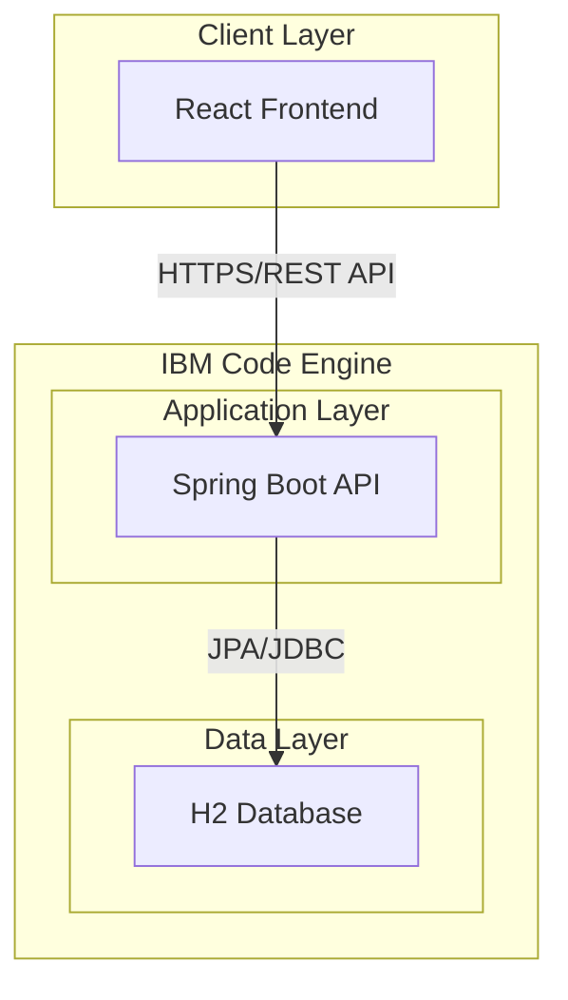
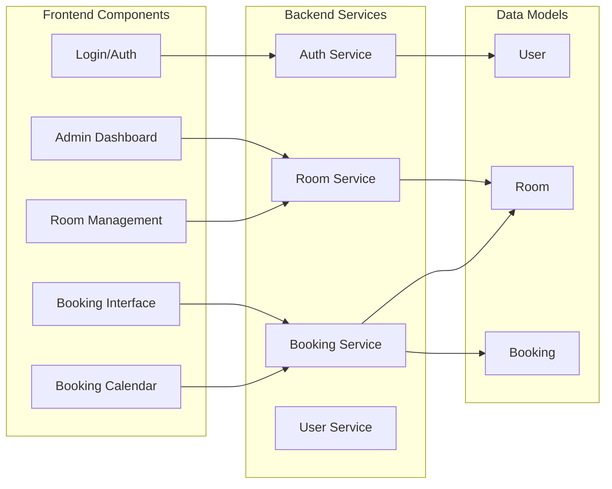
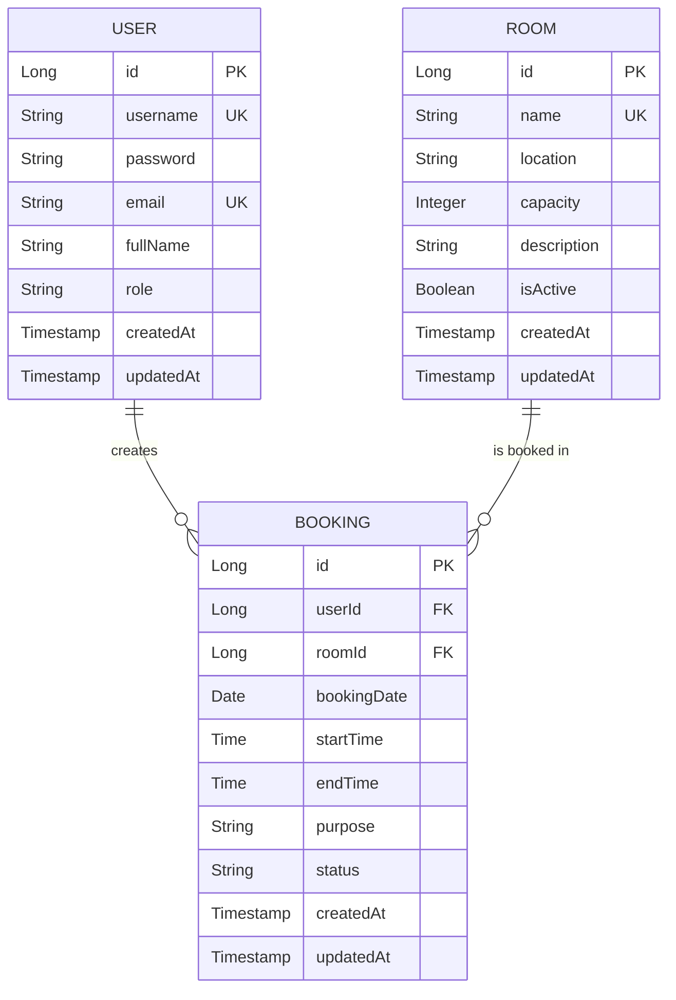
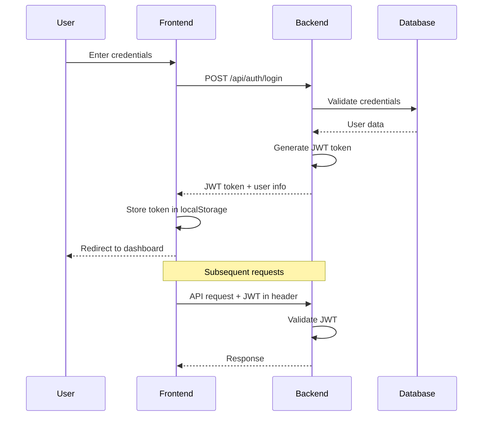
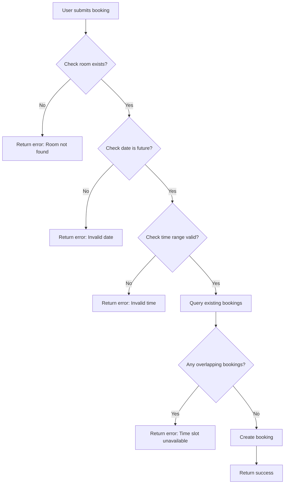

# Meeting Room Booking Application - Architecture & Tech Stack

## Project Overview
A web-based Meeting Room Booking application for medium-sized organizations (50-200 users) with admin room management, user booking capabilities, authentication, and conflict detection.

## Recommended Tech Stack

### Frontend
- **Framework**: React 18+ with TypeScript
- **State Management**: React Context API + Hooks (or Redux Toolkit for complex state)
- **UI Library**: Material-UI (MUI) or Ant Design
- **HTTP Client**: Axios
- **Routing**: React Router v6
- **Form Handling**: React Hook Form + Yup validation
- **Date/Time**: date-fns or Day.js
- **Build Tool**: Vite (faster than Create React App)

### Backend
- **Framework**: Spring Boot 3.x
- **Language**: Java 17 or 21 LTS
- **Security**: Spring Security with JWT
- **Database**: H2 Database (in-memory for dev, file-based for production)
- **ORM**: Spring Data JPA with Hibernate
- **API Documentation**: SpringDoc OpenAPI (Swagger)
- **Validation**: Jakarta Bean Validation
- **Build Tool**: Maven or Gradle

### Deployment
- **Platform**: IBM Code Engine
- **Containerization**: Docker
- **Frontend Serving**: Nginx (within container) or serve as static files
- **Backend**: Spring Boot embedded Tomcat

## System Architecture

### High-Level Architecture



### Component Architecture



## Database Schema

### Entity Relationship Diagram



### Table Definitions

#### USER Table
- `id`: Primary Key (Auto-increment)
- `username`: Unique, Not Null
- `password`: Hashed, Not Null
- `email`: Unique, Not Null
- `full_name`: Not Null
- `role`: ENUM (ADMIN, USER), Default: USER
- `created_at`: Timestamp
- `updated_at`: Timestamp

#### ROOM Table
- `id`: Primary Key (Auto-increment)
- `name`: Unique, Not Null
- `location`: Not Null
- `capacity`: Integer, Not Null
- `description`: Text
- `is_active`: Boolean, Default: true
- `created_at`: Timestamp
- `updated_at`: Timestamp

#### BOOKING Table
- `id`: Primary Key (Auto-increment)
- `user_id`: Foreign Key → USER(id)
- `room_id`: Foreign Key → ROOM(id)
- `booking_date`: Date, Not Null
- `start_time`: Time, Not Null
- `end_time`: Time, Not Null
- `purpose`: Text
- `status`: ENUM (PENDING, CONFIRMED, CANCELLED), Default: CONFIRMED
- `created_at`: Timestamp
- `updated_at`: Timestamp
- **Constraint**: Unique (room_id, booking_date, start_time, end_time) for conflict prevention

## API Design

### Authentication Endpoints
- `POST /api/auth/register` - Register new user
- `POST /api/auth/login` - Login and get JWT token
- `POST /api/auth/refresh` - Refresh JWT token
- `GET /api/auth/me` - Get current user info

### Room Management Endpoints (Admin Only)
- `GET /api/rooms` - List all rooms
- `GET /api/rooms/{id}` - Get room details
- `POST /api/rooms` - Create new room
- `PUT /api/rooms/{id}` - Update room
- `DELETE /api/rooms/{id}` - Delete room (soft delete)

### Booking Endpoints
- `GET /api/bookings` - List all bookings (with filters)
- `GET /api/bookings/{id}` - Get booking details
- `GET /api/bookings/my-bookings` - Get current user's bookings
- `GET /api/bookings/room/{roomId}` - Get bookings for a specific room
- `POST /api/bookings` - Create new booking
- `PUT /api/bookings/{id}` - Update booking (owner or admin)
- `DELETE /api/bookings/{id}` - Cancel booking (owner or admin)
- `GET /api/bookings/check-availability` - Check room availability

### User Endpoints
- `GET /api/users` - List users (Admin only)
- `GET /api/users/{id}` - Get user details
- `PUT /api/users/{id}` - Update user profile

## Security Architecture

### Authentication Flow



### Security Features
1. **JWT Authentication**: Stateless authentication with access tokens
2. **Password Hashing**: BCrypt with salt
3. **Role-Based Access Control (RBAC)**: Admin vs User roles
4. **CORS Configuration**: Restrict origins in production
5. **Input Validation**: Server-side validation for all inputs
6. **SQL Injection Prevention**: JPA/Hibernate parameterized queries

## Booking Conflict Detection

### Conflict Detection Logic



### Overlap Detection Query
Check for existing bookings where:
- Same room
- Same date
- Time ranges overlap: `(new_start < existing_end) AND (new_end > existing_start)`

## Frontend Architecture

### Component Structure
```
src/
├── components/
│   ├── common/
│   │   ├── Header.tsx
│   │   ├── Sidebar.tsx
│   │   ├── Loading.tsx
│   │   └── ErrorBoundary.tsx
│   ├── auth/
│   │   ├── Login.tsx
│   │   ├── Register.tsx
│   │   └── PrivateRoute.tsx
│   ├── admin/
│   │   ├── RoomList.tsx
│   │   ├── RoomForm.tsx
│   │   └── RoomDetails.tsx
│   ├── booking/
│   │   ├── BookingCalendar.tsx
│   │   ├── BookingForm.tsx
│   │   ├── BookingList.tsx
│   │   └── MyBookings.tsx
│   └── user/
│       └── Profile.tsx
├── contexts/
│   └── AuthContext.tsx
├── services/
│   ├── api.ts
│   ├── authService.ts
│   ├── roomService.ts
│   └── bookingService.ts
├── hooks/
│   ├── useAuth.ts
│   └── useBookings.ts
├── types/
│   └── index.ts
├── utils/
│   ├── dateUtils.ts
│   └── validators.ts
└── App.tsx
```

### Key Features
1. **Responsive Design**: Mobile-friendly interface
2. **Real-time Validation**: Client-side form validation
3. **Loading States**: Skeleton loaders and spinners
4. **Error Handling**: User-friendly error messages
5. **Calendar View**: Visual booking calendar with availability

## Backend Architecture

### Package Structure
```
src/main/java/com/meetingroom/
├── config/
│   ├── SecurityConfig.java
│   ├── JwtConfig.java
│   └── CorsConfig.java
├── controller/
│   ├── AuthController.java
│   ├── RoomController.java
│   ├── BookingController.java
│   └── UserController.java
├── service/
│   ├── AuthService.java
│   ├── RoomService.java
│   ├── BookingService.java
│   └── UserService.java
├── repository/
│   ├── UserRepository.java
│   ├── RoomRepository.java
│   └── BookingRepository.java
├── model/
│   ├── User.java
│   ├── Room.java
│   └── Booking.java
├── dto/
│   ├── LoginRequest.java
│   ├── LoginResponse.java
│   ├── RoomDTO.java
│   └── BookingDTO.java
├── security/
│   ├── JwtTokenProvider.java
│   └── JwtAuthenticationFilter.java
├── exception/
│   ├── GlobalExceptionHandler.java
│   ├── ResourceNotFoundException.java
│   └── BookingConflictException.java
└── MeetingRoomApplication.java
```

## Deployment Strategy

### Docker Configuration

#### Backend Dockerfile
```dockerfile
FROM openjdk:17-slim
WORKDIR /app
COPY target/*.jar app.jar
EXPOSE 8080
ENTRYPOINT ["java", "-jar", "app.jar"]
```

#### Frontend Dockerfile
```dockerfile
FROM node:18-alpine as build
WORKDIR /app
COPY package*.json ./
RUN npm ci
COPY . .
RUN npm run build

FROM nginx:alpine
COPY --from=build /app/dist /usr/share/nginx/html
COPY nginx.conf /etc/nginx/conf.d/default.conf
EXPOSE 80
CMD ["nginx", "-g", "daemon off;"]
```

### IBM Code Engine Deployment

1. **Build Docker Images**
   - Backend: Spring Boot application
   - Frontend: React app with Nginx

2. **Push to Container Registry**
   - IBM Container Registry or Docker Hub

3. **Deploy to Code Engine**
   - Create application from container image
   - Configure environment variables
   - Set up auto-scaling (min: 1, max: 5 instances)
   - Configure health checks

4. **Environment Variables**
   - `SPRING_PROFILES_ACTIVE=prod`
   - `JWT_SECRET=<secure-secret>`
   - `H2_FILE_PATH=/data/meetingroom.db`
   - `CORS_ALLOWED_ORIGINS=<frontend-url>`

### H2 Database Configuration

For production on IBM Code Engine:
- Use file-based H2 database
- Mount persistent volume for database file
- Configure regular backups
- Connection URL: `jdbc:h2:file:/data/meetingroom;AUTO_SERVER=TRUE`

## Non-Functional Requirements

### Performance
- API response time: < 200ms for 95th percentile
- Frontend load time: < 3 seconds
- Support 200 concurrent users

### Scalability
- Horizontal scaling via IBM Code Engine
- Stateless backend design
- Database connection pooling

### Reliability
- 99.5% uptime target
- Graceful error handling
- Database backup strategy

### Security
- HTTPS only in production
- JWT token expiration: 1 hour
- Refresh token: 7 days
- Rate limiting on authentication endpoints

## Development Workflow

1. **Local Development**
   - Backend: Run Spring Boot with H2 in-memory
   - Frontend: Run Vite dev server
   - Use CORS configuration for local testing

2. **Testing**
   - Backend: JUnit 5 + Mockito
   - Frontend: Jest + React Testing Library
   - Integration tests for critical flows

3. **CI/CD**
   - Build and test on commit
   - Deploy to staging environment
   - Manual approval for production

## Future Enhancements

1. **Phase 2 Features**
   - Email notifications
   - Calendar integration (Google Calendar, Outlook)
   - Recurring bookings
   - Room equipment management

2. **Phase 3 Features**
   - Mobile app (React Native)
   - Advanced reporting and analytics
   - Room usage statistics
   - Booking approval workflow

3. **Technical Improvements**
   - Migrate to PostgreSQL for production
   - Implement caching (Redis)
   - Add WebSocket for real-time updates
   - Implement audit logging

## Estimated Timeline

- **Week 1-2**: Backend setup, database schema, authentication
- **Week 3-4**: Room and booking APIs, conflict detection
- **Week 5-6**: Frontend components, integration
- **Week 7**: Testing, bug fixes, documentation
- **Week 8**: Deployment to IBM Code Engine, final testing

Total: **8 weeks** for MVP with core features