# Create and Deploy an app in IBM Code Engine using IBM Bob


# Create and Deploy an app in IBM Code Engine using IBM Bob

This article demonstrates how IBM Bob is leveraged to build a simple python app and deploy it in IBM Code Engine.

## Building the App Using Bob

### 1. Start in Plan Mode

- IBM Bob was started in Plan mode.

### 2. Provide the Initial Prompt

- The following prompt was entered to request Bob to suggest the technology stack and architecture:

```
Need to build a simple web-based Meeting Room Booking application. The admin should be able to manage meeting rooms (create, update, and delete). Users should be able to book a meeting room for a specific time period during the day and view all bookings.

Can you suggest me the possible tech stack and architectures?
```

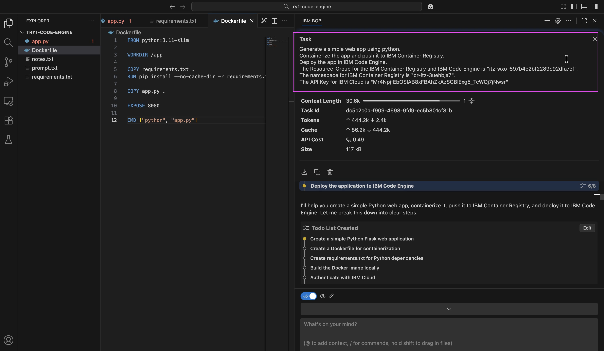

### 3. Review Tech Stack Options

- Bob listed multiple technology stack options.

### 4. Select Preferred Stack

- The React + Spring Boot–based stack was selected.

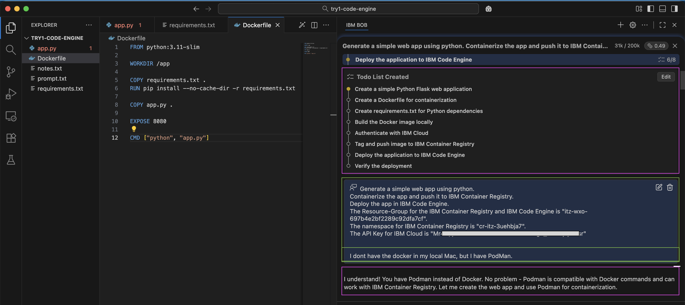

### 5. Define Application Scale

- Bob asked for the expected scale of the application.
- The 50–100 users option was selected.

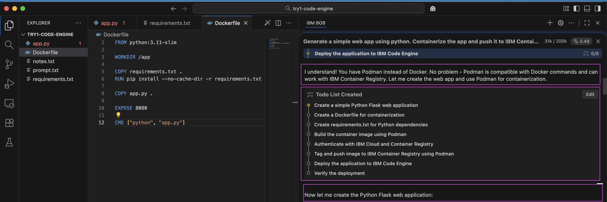

### 6. Review and Approve To‑Do List

- Bob generated a to‑do list based on the provided prompt.
- The to‑do list was reviewed and approved.

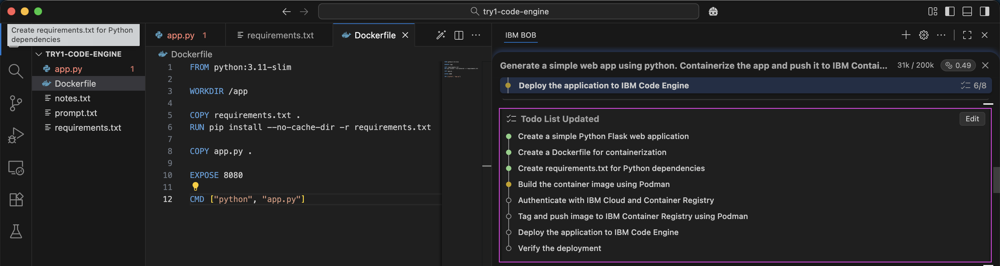

### 7. Architecture & Tech Stack Recommendation

- Bob created the architecture and technology stack recommendation document.

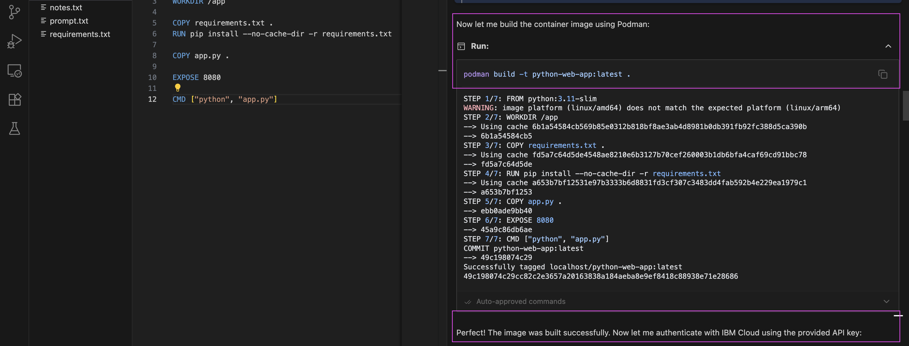

### 8. Approve the Plan

- Bob requested approval for the recommended architecture and implementation plan.
- The request was approved.

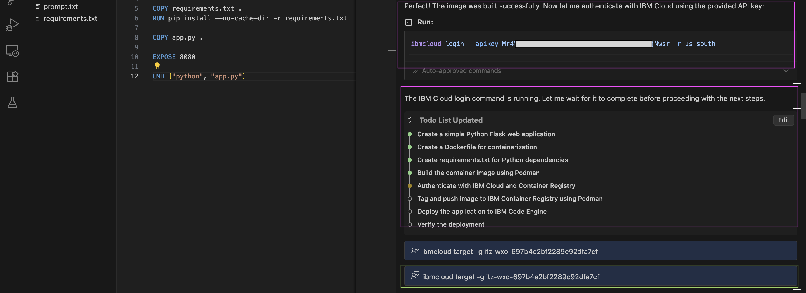

### 9. Planning Summary

- Bob displayed the planning summary.

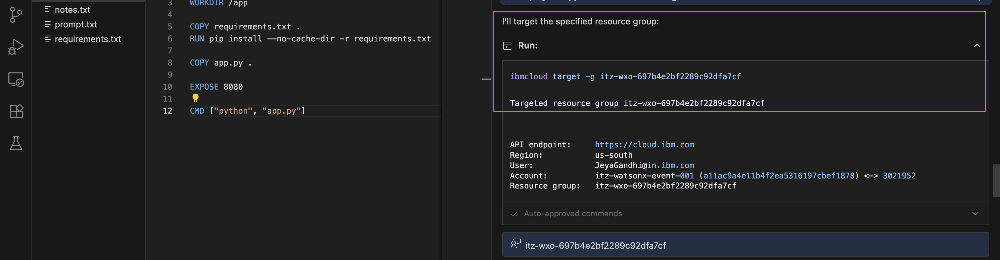

### 10. Switch to Advanced Mode

- Bob requested switching to Advanced mode.
- The request was approved.

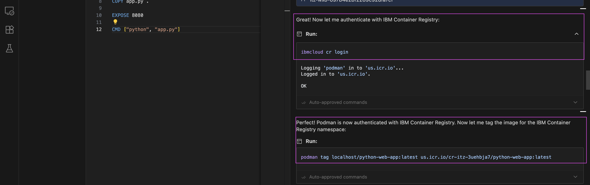

### 11. Begin Implementation

- Bob was prompted to proceed with the implementation.

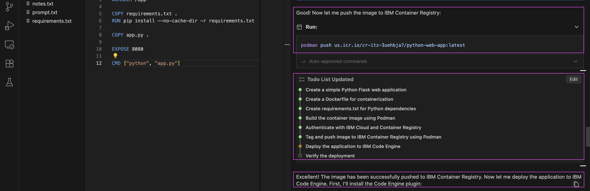

### 12. Project Structure Setup

- Bob requested approval to create the project structure.
- The request was approved.

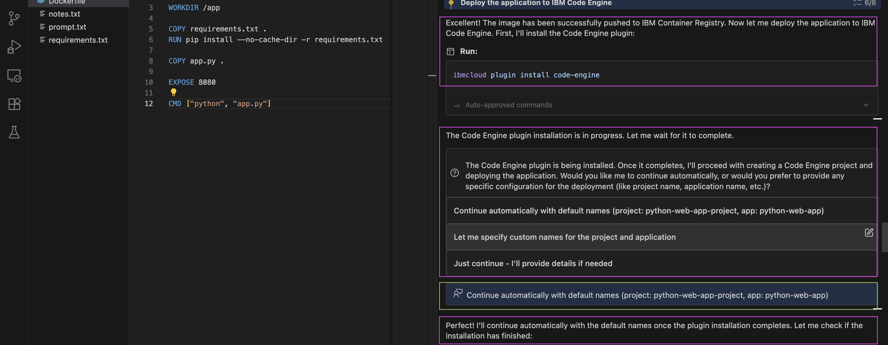

### 13. Backend Development

- Bob requested approval for the next steps, including:
- Database schema creation
- The request was approved.

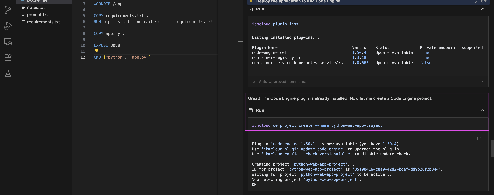

- Backend implementation completed.

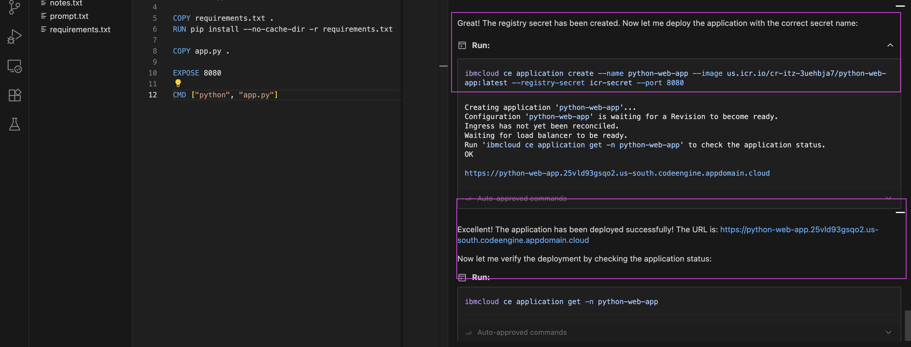

### 14. Frontend Development

- Bob was prompted to implement the frontend.


- Frontend foundation was completed.


### 15. Frontend Dependencies

- Bob requested approval to run frontend dependencies.
- Approval was granted.


### 16. Application Testing

- Bob requested approval to test the complete application flow.
- End‑to‑end testing was executed successfully.


### 17. Deployment Configuration

- Bob requested approval to generate deployment configuration for IBM Code Engine.
- The request was approved.


### 18. Final Output

- All generated source code and Markdown documentation files are now available in the [/project](project) folder.


## The App

Here is the Bob generated App.

1. Home Page of the application


2. Meeting rooms dashboard


3. Meeting room edit page


