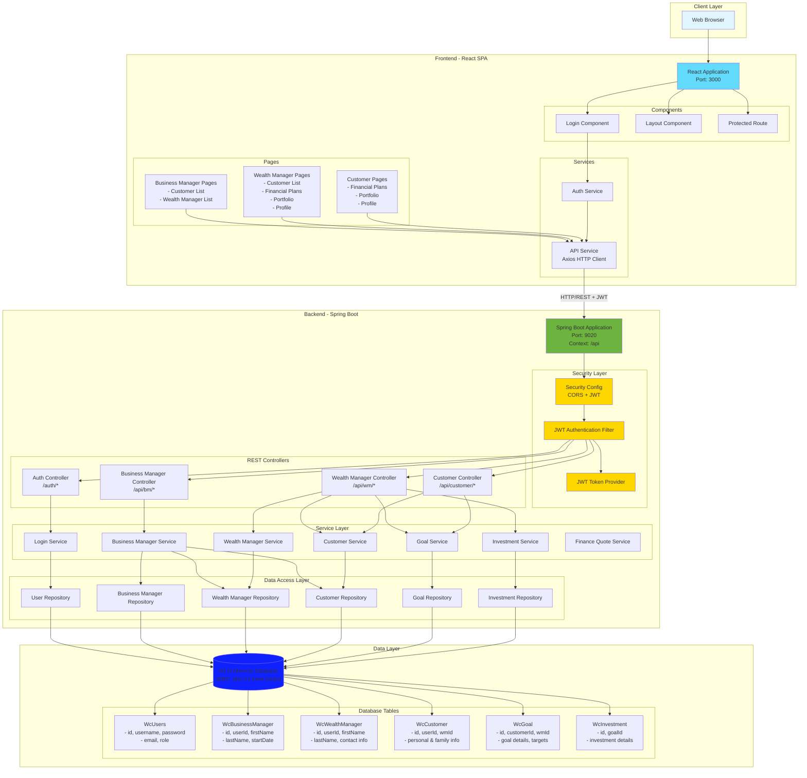
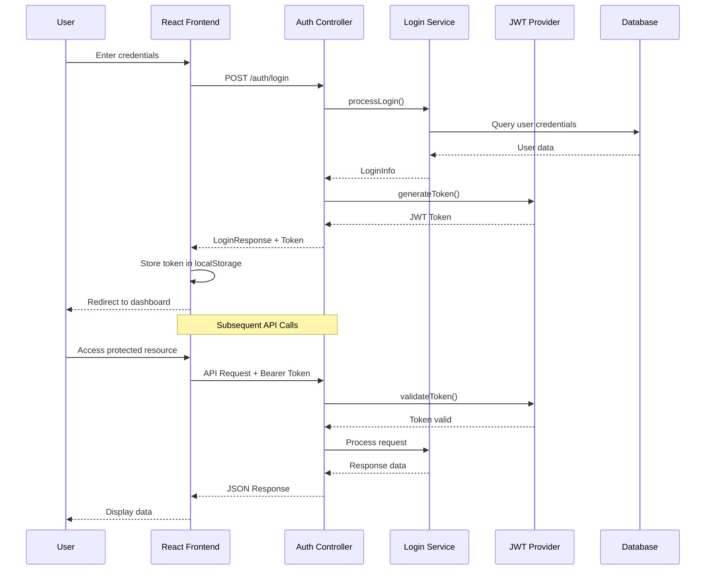
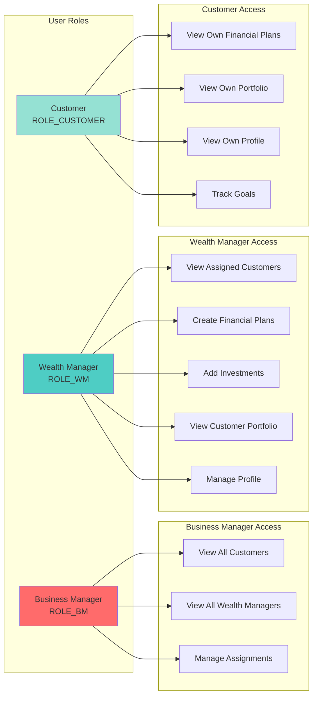
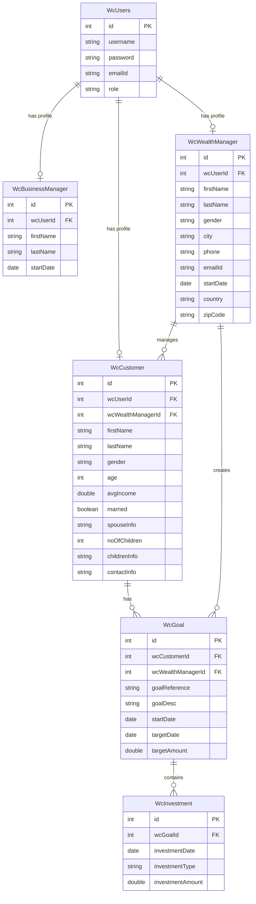
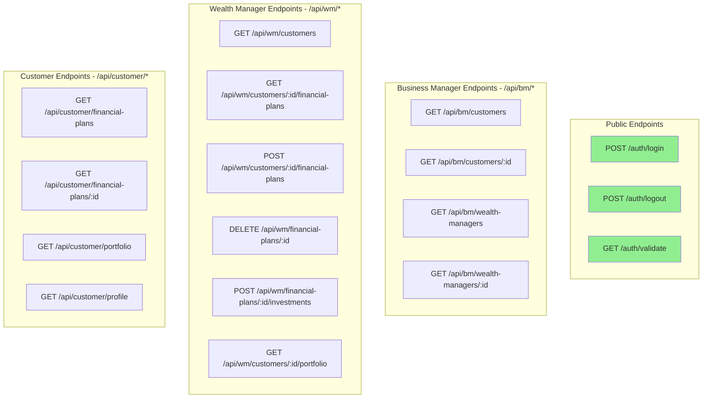
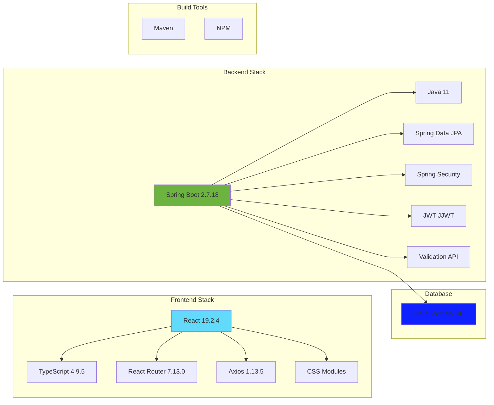
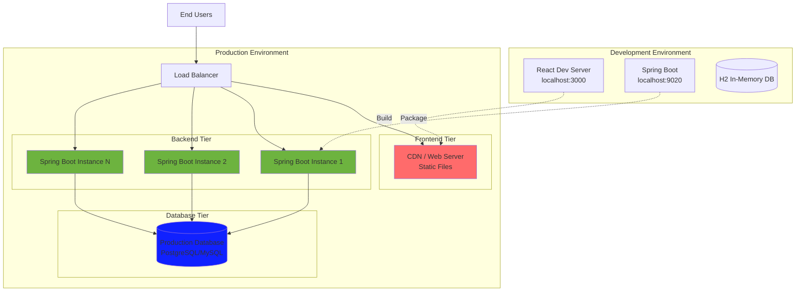

# WealthPlan Application Architecture

## System Overview

The WealthPlan application is a modern wealth management system that has been migrated from a JSP-based monolithic architecture to a React + Spring Boot microservices architecture with JWT authentication.

## High-Level Architecture Diagram

## Authentication Flow

## Role-Based Access Control

## Data Model Relationships

## API Endpoints Structure

## Technology Stack

## Deployment Architecture

## Security Architecture

```mermaid
graph TB
    subgraph "Security Layers"
        CORS[CORS Configuration<br/>Allowed Origins]
        JWT[JWT Token Validation]
        RBAC[Role-Based Access Control]
        HTTPS[HTTPS/TLS]
    end
    
    subgraph "Authentication Flow"
        Login[Login Request]
        Validate[Validate Credentials]
        Generate[Generate JWT Token]
        Store[Store in localStorage]
    end
    
    subgraph "Authorization Flow"
        Request[API Request + Token]
        Extract[Extract Token from Header]
        Verify[Verify Token Signature]
        CheckRole[Check User Role]
        Allow[Allow/Deny Access]
    end
    
    HTTPS --> CORS
    CORS --> JWT
    JWT --> RBAC
    
    Login --> Validate
    Validate --> Generate
    Generate --> Store
    
    Request --> Extract
    Extract --> Verify
    Verify --> CheckRole
    CheckRole --> Allow

    style CORS fill:#ffd700
    style JWT fill:#ffd700
    style RBAC fill:#ffd700
    style HTTPS fill:#90EE90
```

## Key Features

### 1. **Separation of Concerns**
- Frontend and backend are completely decoupled
- Independent scaling and deployment
- Clear API contracts

### 2. **Stateless Authentication**
- JWT tokens eliminate server-side session management
- Tokens contain user identity and roles
- Automatic token validation on each request

### 3. **Role-Based Access**
- Three distinct user roles: Business Manager, Wealth Manager, Customer
- Each role has specific permissions and accessible endpoints
- Protected routes in frontend and backend

### 4. **Modern Tech Stack**
- React with TypeScript for type safety
- Spring Boot for rapid development
- H2 database for development (easily switchable to production DB)

### 5. **RESTful API Design**
- Standard HTTP methods (GET, POST, DELETE)
- JSON request/response format
- Consistent error handling

## Configuration

### Backend Configuration
- **Port**: 9020
- **Context Path**: /api
- **JWT Secret**: Configurable in application.properties
- **Token Expiration**: 24 hours (86400000 ms)
- **CORS**: Configured for localhost:3000, localhost:3001

### Frontend Configuration
- **Port**: 3000
- **API Base URL**: http://localhost:9020
- **Token Storage**: localStorage
- **Auto-redirect**: On authentication failure

## Migration Benefits

1. **Scalability**: Frontend and backend can scale independently
2. **Performance**: SPA provides faster user experience
3. **Security**: JWT-based stateless authentication
4. **Maintainability**: Clear separation of concerns
5. **Modern UX**: React provides rich, interactive interface
6. **API-First**: Backend can serve multiple clients
7. **Type Safety**: TypeScript reduces runtime errors
8. **Deployment Flexibility**: Can deploy to different environments

---

*This architecture document was generated for the WealthPlan application migration from JSP to React + Spring Boot.*
